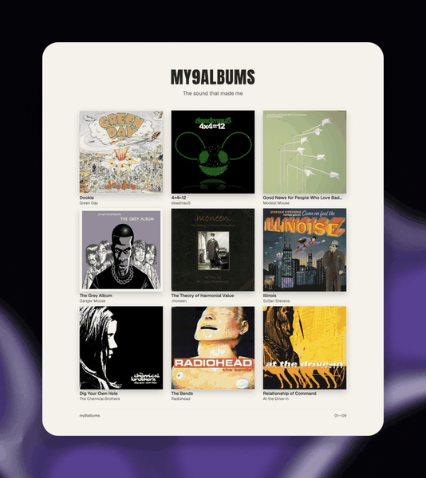

# Glance

Glance is a native screenshot editor for macOS, with experimental support for Omarchy.
Capture a screenshot, add arrows and labels, then copy, save, or share it.
Frame images with backdrops and export animations as GIF or MP4.



*Six-second loop made with Glance’s padding and animated Lava backdrop.
[See a still annotation example](docs/assets/glance-example.png).*

## Install

Download a binary from the [latest release](https://github.com/modem-dev/glance-desktop/releases/latest).

### macOS — Apple Silicon, macOS 12+

1. Download `Glance-<version>-macos-arm64.zip` and extract it.
2. Move `Glance.app` to **Applications** and open it.
3. If macOS blocks it, follow the [FAQ below](#macos-faq).

### Omarchy — x86_64, experimental

Download the release's `.pkg.tar.zst` package, then install and launch it:

```sh
sudo pacman -U ./glance-desktop-*.pkg.tar.zst
glance desktop
```

See the [Omarchy guide](docs/linux.md) for checksum verification and global capture bindings.

## Your first screenshot

The app opens with a practice canvas. Try the tools there, or capture your screen:

1. Press **⌘⌥2** to select an area, or **⌘⌥3** to capture the main display.
   Grant Screen Recording access when prompted, then quit and reopen Glance.
2. Press **A** and draw an arrow. Press **T**, click, and type a label.
3. Press **⌘C** to copy the image or **⌘S** to save a PNG.
4. To share a temporary link, press **⌘⇧C** and paste it into a chat.

On Omarchy, use **Ctrl** for editor shortcuts; use the guide above to capture globally.
Open **Backdrop** to add framing or motion, and **Export** to save a GIF or MP4.
[Read the usage guide](docs/usage.md) for selection, tool options, and shortcuts.

Editing, copying, and file exports work locally. Sharing a link uploads an encrypted
PNG to [glance.sh](https://glance.sh). Anyone with the link can retrieve it until
it expires, usually after about 30 minutes.

## Terminal and agent interfaces

The `glance` shell command is the CLI: run `glance --help`, `glance get-document`,
`glance code search --query annotation`, or `glance --mcp` directly.
`glance desktop --automation` opens the native editor with local automation enabled.
Launching the macOS app still opens its editor window.
See [CLI, MCP, and Code Mode](docs/interfaces.md) for the complete interface.

## macOS FAQ

### macOS says it cannot verify Glance. How do I open it?

The current download is ad-hoc signed and has not been notarized by Apple.
For a copy downloaded from this repository's releases, try opening it once,
then go to **System Settings → Privacy & Security → Open Anyway** and confirm **Open**.
On macOS 12, use **System Preferences → Security & Privacy → General**.

“Cannot verify” is different from “will damage your computer.” For the latter,
stop and report the exact message in [an issue](https://github.com/modem-dev/glance-desktop/issues).
See [Apple's explanation](https://support.apple.com/en-us/102445).

### Why can't Glance capture my screen?

Enable Glance under **Privacy & Security → Screen Recording** (called
**Screen & System Audio Recording** on newer macOS), then quit and reopen it.
On macOS 12, this setting is under **Security & Privacy → Privacy**.
If access is already enabled, remove Glance's entry and add the installed app again.

## More

- [Usage](docs/usage.md) · [Omarchy](docs/linux.md) · [MCP setup](mcp/README.md)
- [Build from source](BUILD.md) · [Contribute](CONTRIBUTING.md) · [Architecture](docs/architecture.md)
- [Report a bug](https://github.com/modem-dev/glance-desktop/issues) · [Security](SECURITY.md) · [Changelog](CHANGELOG.md)

## License

[MIT](LICENSE). See [third-party notices](THIRD_PARTY_NOTICES.md) for bundled code and assets.
